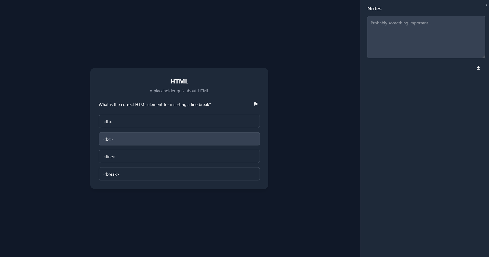

# Queasy – Simple Quiz App

Queasy is an interactive quiz web application made to make learning easier. Built with Nuxt 3, Vue 3, and TailwindCSS, it features a modern UI, math rendering, and persistent notes for effective study.

## Features

- **Test your knowledge and learn**: Answer multiple-choice questions loaded from `questions.json`.
- **Math Support**: Questions and notes support LaTeX math rendering using MathJax.
- **Flag & Review**: Flag questions for later review and retry only incorrect or flagged questions.
- **Notes**: Take notes with markdown and math, auto-saved in your browser, and exportable as `.md` files.
- **Responsive UI**: Clean, dark-themed interface using Nuxt UI and TailwindCSS.

## Screenshots



## Getting Started

### Prerequisites
- [Node.js](https://nodejs.org/) (v18+ recommended)
- [pnpm](https://pnpm.io/) (recommended)

### Installation
```sh
pnpm install
```

### Development
```sh
pnpm dev
```
App will be available at `http://localhost:3000`.

### Build for Production
```sh
pnpm build
```

### Generate Static Site
```sh
pnpm generate
```

## Project Structure
- `pages/index.vue` – Main quiz and notes UI
- `public/questions.json` – Quiz questions (edit or extend as needed)
- `public/config.json` - Quiz details and configuration
- `assets/css/main.css` – TailwindCSS and UI styles
- `nuxt.config.ts` – Nuxt configuration

## Customization
- **Add/Edit Questions**: Modify `public/questions.json` (see format in file)
- **Math in Notes**: Use LaTeX syntax (e.g., `$P(A \cap B)$`)

## Dependencies
- [Nuxt 3](https://nuxt.com/)
- [Vue 3](https://vuejs.org/)
- [TailwindCSS](https://tailwindcss.com/)
- [@nuxt/ui](https://ui.nuxt.com/)
- [markdown-it](https://github.com/markdown-it/markdown-it)
- [markdown-it-mathjax3](https://github.com/waylonflinn/markdown-it-mathjax3)

## License
MIT

---

*Made with ❤️ for the learners.*